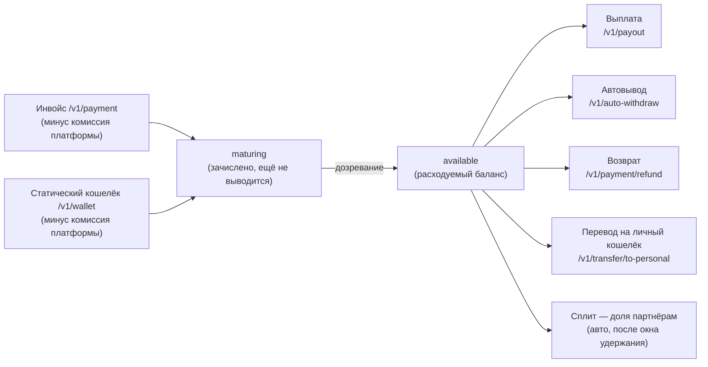

Отдельные методы (приём, выплаты, автовывод, переводы) станут понятнее, если увидеть общую картину:
откуда деньги приходят на баланс, в каких они состояниях и какими путями уходят. Эта страница —
концептуальная карта. За деталями каждого метода — ссылки в [Справочник](/reference/overview).

---

## Общая схема

Ключевая идея: **средства попадают на баланс сразу, но не всегда сразу выводимы**. Между «зачислено» и
«можно вывести» стоит дозревание (maturity).

---

## Приход: два канала

Деньги на баланс мерчанта приходят двумя разными путями — и ведут они себя по-разному.

| Канал | Что это | Комиссия платформы | Вебхук |
|---|---|---|---|
| [Инвойс](/reference/payment-create) | Разовый счёт на сумму | **Удерживается** (по умолч. 1.5 % + \$0.30/платёж) | `invoice.*` |
| [Статический кошелёк](/reference/wallet-create) | Постоянный адрес пополнения | **Удерживается** (по вашей ставке, по умолч. ~1.5 %) | `wallet.paid` |

<Note>
  Оба канала зачисляют **нетто** — за вычетом комиссии платформы. В вебхуке `wallet.paid` поле
  `payment_amount` — это брутто (что пришло на адрес); на баланс попадёт меньше на размер комиссии.
  Сверяйтесь по [`/v1/balance`](/reference/balance).
</Note>

Подробнее про разницу — [Объект кошелька](/reference/wallet-object) и
[Статические кошельки](/guides/static-wallets).

---

## Состояния средств на балансе

Средства на балансе бывают в трёх состояниях. Метод [`/v1/balance`](/reference/balance) показывает
**одно число** (available + maturing вместе; held не входит), и не всё, что показано, выводимо
прямо сейчас.

| Состояние | Что значит | Видно в `/v1/balance`? | Выводится? |
|---|---|---|---|
| **available (зрелое)** | Расходуемый остаток, набравший подтверждения. | Да | Да |
| **maturing (незрелое)** | Депозит зачислен, но ещё не набрал подтверждений (reorg-безопасность). | Да (входит в `balance`) | **Нет** |
| **held (замороженное)** | Зарезервировано под операцию (например, `payout_held` под выплату в процессе). | Нет | Нет |

### Почему «баланс есть, а вывести нельзя»

Самый частый источник путаницы. Свежий депозит **сразу** отражается в `balance`, но пока он под
maturity-холдом, выплата на сумму, включающую незрелые средства, вернёт **`409 payout.funds_maturing`**.
То есть выводимый остаток может быть временно меньше показанного.

**Что делать.** Важная честная оговорка: API **не отдаёт разбивку** available/maturing —
[`/v1/balance`](/reference/balance) показывает одно число, в которое незрелые средства уже входят,
поэтому «вычислить зрелую часть» одним вызовом нельзя. Рабочих стратегий две:

- **Повторять выплату с backoff по `409 payout.funds_maturing`** — незрелое станет зрелым
  автоматически, и повтор пройдёт. Готовый код ретрая уже есть в
  [рецепте устойчивого клиента](/guides/resilient-client#не-все-409-финальны).
- **Выводить консервативно** — сумму заведомо меньше остатка без учёта свежих депозитов.

Оценить, сколько ждать, можно так: reorg‑безопасный порог подтверждений сети — поле
`min_confirmations` в [`GET /v1/currencies`](/reference/currencies); прогресс конкретного платежа —
`confirmations` / `required_confirmations` в [`/v1/payment/info`](/reference/payment-object). Учтите,
что фактический порог зависит и от суммы: крупный платёж зреет дольше.

---

## Расход: пять путей

Списать средства с баланса можно пятью способами. Три из них (выплата, возврат, перевод) инициируете вы
вызовом API; два (автовывод и сплит) срабатывают **сами**, по заранее настроенному правилу.

| Путь | Кто инициирует | Когда используется |
|---|---|---|
| [**Выплата**](/reference/payout-create) | Вы | Вывод на внешний адрес. По API-ключу авто-одобряется, уходит сразу. |
| [**Автовывод**](/reference/auto-withdraw) | **Шлюз, авто** | Автоматически выводит чистую сумму депозита на заданный адрес. |
| [**Возврат**](/reference/payment-refund) | Вы | Вернуть средства оплаченного платежа. Списывает **всю** сумму, которую заплатил покупатель. |
| [**Перевод на личный кошелёк**](/reference/transfer-to-personal) | Вы | Перевод владельцу аккаунта (общий для его магазинов). |
| [**Сплит**](/reference/split-rule) | **Шлюз, авто** | Доля каждого входящего платежа уходит партнёрам по вашему правилу. → [Сплит‑платежи](/guides/split-payments) |

<Note>
  **Сплит легко упустить из виду при сверке баланса.** В отличие от выплаты, у него нет вашего вызова
  API: вы один раз настроили правило «20 % партнёру», и дальше деньги уходят сами — но **не сразу**, а
  после окна удержания `refund_hold_hours`. Из-за этой задержки баланс может «худеть» на суммы, которых
  вы не ждёте сегодня: это рассчитались платежи, пришедшие несколько дней назад. Окно нужно потому, что
  возврат списывает с вас **всю** сумму покупателя — если бы доли ушли партнёрам сразу, на возврат бы не
  осталось. → [Сплит‑платежи](/guides/split-payments)
</Note>

<Note>
  **Односторонние двери.** Перевод на личный кошелёк **вводит** средства В личный кошелёк, но вывод
  оттуда через API закрыт — только в кабинете под 2FA. Аналогично ротация ключа — только в кабинете.
  Это осознанные ограничения безопасности, см. [Безопасность в проде](/guides/production-security).
</Note>

---

## Комиссии: кто и за что платит

В движении средств участвуют две разные комиссии — не путайте их.

| Комиссия | Что это | Где настраивается |
|---|---|---|
| **Наша (комиссия платформы)** | Доля Oblodai с приёма (у реферала — 1.4 %). Инвойс: по умолчанию **1.5 % + \$0.30/платёж**. Статический кошелёк: те же **1.5 %**, но **без** фиксированных \$0.30. | Ставка мерчанта (override или глобальная); кто несёт её при возврате — [`refund-fee-config`](/reference/payout-refund-fee-config). |
| **Сетевая (газ)** | Плата блокчейн-сети за транзакцию выплаты/возврата. | [`fee-config`](/reference/payout-fee-config) (кто несёт при выплате). |

Предрасчёт по конкретной выплате (сколько уйдёт с баланса, сколько получит адрес) — без создания:
[`/v1/payout/calculate`](/reference/payout-calculate).

---

## Защита от волатильности (VRCS)

Если вы принимаете волатильные активы, но хотите держать баланс в стабильной монете, включите
[VRCS](/reference/vrcs) — он авто-конвертирует волатильные депозиты в USDT при зачислении. Это
влияет на то, в какой валюте окажется ваш `available`.

---

## Реферальные начисления

Отдельный «карман» — реферальные доходы. Они начисляются как доля **нашей** комиссии с приведённых
мерчантов и показываются в [`/v1/referral/info`](/reference/referral-info) в **minor-единицах**.
Это не тот же поток, что торговый баланс. → [Форматы сумм](/reference/basics-money)

---

## Как это выглядит в цифрах (пример)

1. Покупатель платит по инвойсу 100 USDT. Наша комиссия 1.5 % + \$0.30 → удержится ≈ 1.80 → на баланс
   зачислится **≈ 98.2 USDT** (сразу как maturing).
2. Через нужное число подтверждений 98.2 USDT становятся **available**.
3. Вы выводите 50 USDT (`/v1/payout`). Если сетевая комиссия на получателе — адрес получит 50 минус
   газ; с баланса спишется 50. Остаток available — ≈ 48.2 USDT.
4. Если бы те же 100 USDT пришли на **статический кошелёк**, комиссия удержалась бы **тоже** (по вашей
   ставке, по умолчанию ~1.5 %) — на баланс легло бы ≈ 98.5 USDT (фиксированные \$0.30 берутся с инвойса,
   не с пополнения кошелька).

Точные суммы и знаки зависят от валюты/сети — всегда сверяйтесь с ответом
[`/v1/payout/calculate`](/reference/payout-calculate) и [`/v1/balance`](/reference/balance).

---

## Связанные страницы

<CardGroup cols={2}>
  <Card title="POST /v1/balance" href="/reference/balance" icon="arrow-right" horizontal />
  <Card title="Объект выплаты" href="/reference/payout-object" icon="arrow-right" horizontal />
  <Card title="Первая выплата" href="/guides/first-payout" icon="arrow-right" horizontal />
  <Card title="Статические кошельки" href="/guides/static-wallets" icon="arrow-right" horizontal />
  <Card title="Рецепт устойчивого клиента" href="/guides/resilient-client" icon="arrow-right" horizontal>
    как обрабатывать maturing и повторы.
  </Card>
  <Card title="Глоссарий" href="/reference/glossary" icon="arrow-right" horizontal>
    available, maturing, held, газ, VRCS.
  </Card>
</CardGroup>
