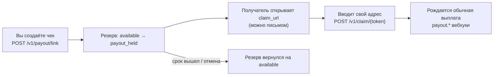

Классическая выплата требует знать адрес получателя заранее. **Крипто-чек** (выплатная ссылка)
решает обратную задачу: вы резервируете сумму и отдаёте получателю **ссылку** — он открывает её,
вводит свой адрес, и выплата уходит ему. Идеально для бонусов, призов, кэшбэка, реферальных
вознаграждений и любых ситуаций, где спрашивать адрес заранее неудобно.

## Как это работает



Деньги списываются с доступного баланса сразу при создании (в удержание `payout_held`), поэтому
чек **всегда обеспечен**: получатель не может увидеть «недостаточно средств». Невостребованный чек
возвращает резерв автоматически по сроку — или раньше, если вы его отмените.

## Шаг 1. Создайте чек

<CodeGroup>

```python Python
link = call("/v1/payout/link", {
    "currency": "USDT", "network": "tron", "amount": "25",
    "reference": "bonus-42",          # ваш ключ дедупликации — задавайте всегда
    "title": "Бонус за июль",
    "note": "Спасибо за участие в программе!",
    "email": "user@example.com",      # необязательно: мы сами отправим письмо
    "expires_in_hours": 168,          # 7 дней; БЕЗ поля чек живёт всего 1 час
})["result"]

print(link["claim_url"])              # передайте получателю — показывается ОДИН раз
```

```js Node.js
const link = (await call("/v1/payout/link", {
  currency: "USDT", network: "tron", amount: "25",
  reference: "bonus-42",            // ваш ключ дедупликации — задавайте всегда
  title: "Бонус за июль",
  note: "Спасибо за участие в программе!",
  email: "user@example.com",        // необязательно: мы сами отправим письмо
  expires_in_hours: 168,            // 7 дней; БЕЗ поля чек живёт всего 1 час
})).result;

console.log(link.claim_url);        // передайте получателю — показывается ОДИН раз
```

</CodeGroup>

<Warning>
  Два правила, о которые спотыкаются: **(1)** `claim_url` показывается **только в ответе
  создания** — сохраните его сразу, восстановить нельзя; **(2)** всегда задавайте
  `expires_in_hours` — без него чек истечёт **через час**.
</Warning>

Если указали `email`, получателю уйдёт брендированное письмо с кнопкой «Получить средства» и вашим
текстом из `note`. Отправка не критична для чека: даже если письмо не дошло, ссылка работает.

## Шаг 2. Получатель забирает средства

По ссылке открывается страница получения: сумма, ваш заголовок и сообщение, поле для адреса.
Получатель вводит адрес в сети чека — и из резерва рождается **обычная выплата**. Дальше всё как
всегда: подтверждения сети, [`payout.*` вебхуки](/reference/webhook-object) вам, средства — получателю.

- В событиях выплаты `order_id` = `payoutlink:<link_id>` — так вы сопоставите вебхук с чеком.
- Получение **идемпотентно по адресу**: повторное открытие/отправка того же адреса не создаёт
  вторую выплату, а другой адрес после первого получения не принимается.
- Адрес проходит те же проверки, что у выплат: валидация формата, запрет внутренних адресов шлюза,
  комплаенс-скрининг.

## Массовая раздача

До **500 чеков одним запросом** — `POST /v1/payout/link/batch`. Каждый элемент независим (плохой
фейлит только себя), у всех чеков вызова общий `batch_id`:

<CodeGroup>

```python Python
resp = call("/v1/payout/link/batch", {"links": [
    {"currency": "USDT", "network": "tron", "amount": "10",
     "reference": f"airdrop-{i}", "email": user["email"],
     "title": "Airdrop", "expires_in_hours": 336}
    for i, user in enumerate(users)     # до 500 за вызов
]})["result"]

for r in resp["results"]:
    if r["ok"]:
        save_claim_url(r["link"]["reference"], r["link"]["claim_url"])
    else:
        log_failed(r["error"], r["message"])
```

```js Node.js
const resp = (await call("/v1/payout/link/batch", {
  links: users.slice(0, 500).map((u, i) => ({
    currency: "USDT", network: "tron", amount: "10",
    reference: `airdrop-${i}`, email: u.email,
    title: "Airdrop", expires_in_hours: 336,
  })),
})).result;

for (const r of resp.results) {
  if (r.ok) saveClaimUrl(r.link.reference, r.link.claim_url);
  else logFailed(r.error, r.message);
}
```

</CodeGroup>

Больше 500 получателей — шлите страницами. Нужна раздача на **известные** адреса? Это обычные
[массовые выплаты](/guides/batch-operations), чеки не нужны.

## Жизненный цикл и учёт

| Событие | Баланс | Статус чека |
|---|---|---|
| Создание | `available → payout_held` | `funded` |
| Получатель забрал | `payout_held` → выплата ушла | `claimed` |
| Срок вышел (поллер, раз в минуту) | `payout_held → available` | `expired` |
| Вы отменили (`/v1/payout/link/cancel`) | `payout_held → available` | `cancelled` |

Мониторьте выданные чеки через `/v1/payout/link/list` (новые первыми) и `/info` по конкретному.
Отменить можно только невостребованный (`funded`) чек; если получение уже началось — вернётся
статус `claimed` с `payout_id`, двойного возврата не бывает.

<Note>
  **Дедупликация — через `reference`.** Заголовок `Idempotency-Key` на `/v1/payout/link` не
  действует. Повтор создания с тем же `reference` сейчас возвращает `500` (а не повтор ответа) —
  не ретрайте вслепую, проверьте `/list`, появился ли чек.
</Note>

## Связанные страницы

<CardGroup cols={2}>
  <Card title="Справочник: выплатные ссылки" href="/reference/payout-link" icon="arrow-right" horizontal />
  <Card title="Справочник: получение по чеку" href="/reference/claim-public" icon="arrow-right" horizontal />
  <Card title="Первая выплата" href="/guides/first-payout" icon="arrow-right" horizontal />
  <Card title="Модель баланса" href="/guides/balance-and-funds" icon="arrow-right" horizontal>
    Что такое `payout_held` и дозревание средств.
  </Card>
</CardGroup>
