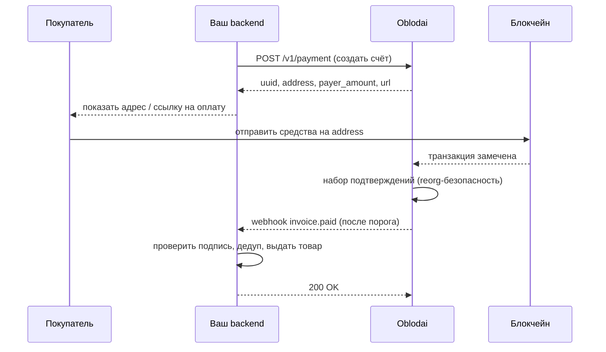
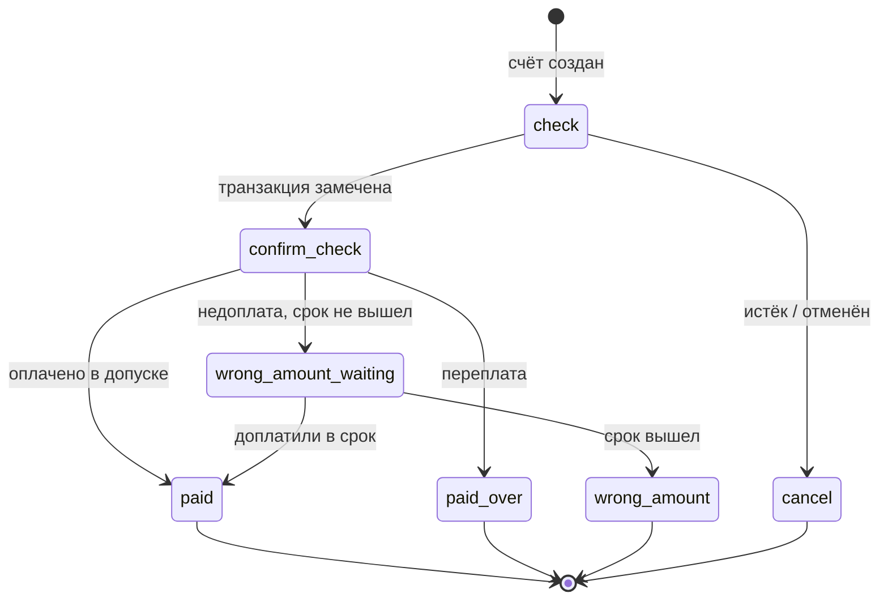
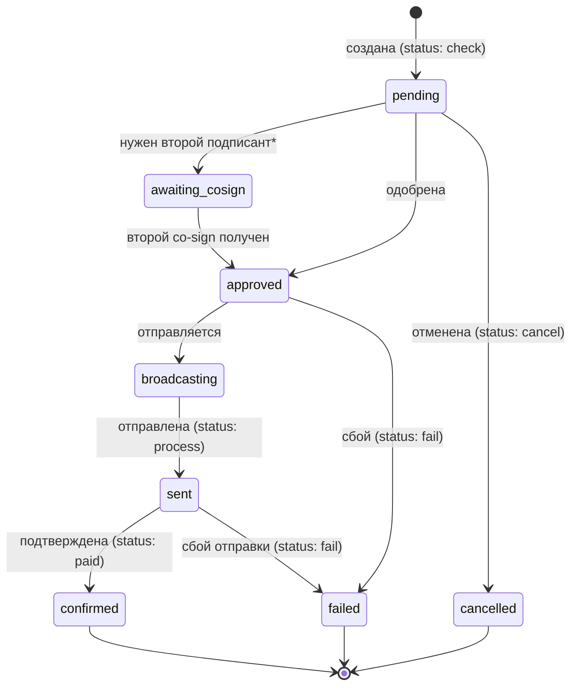
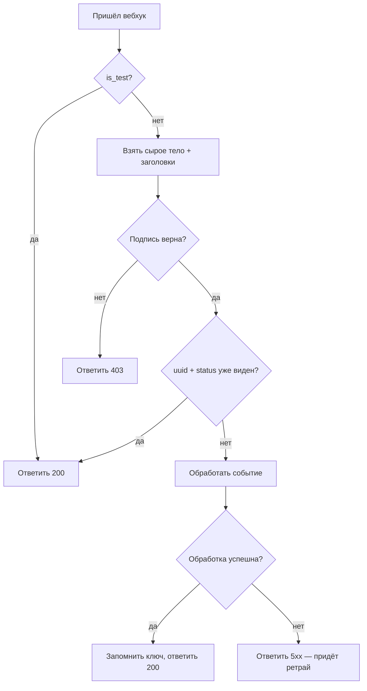
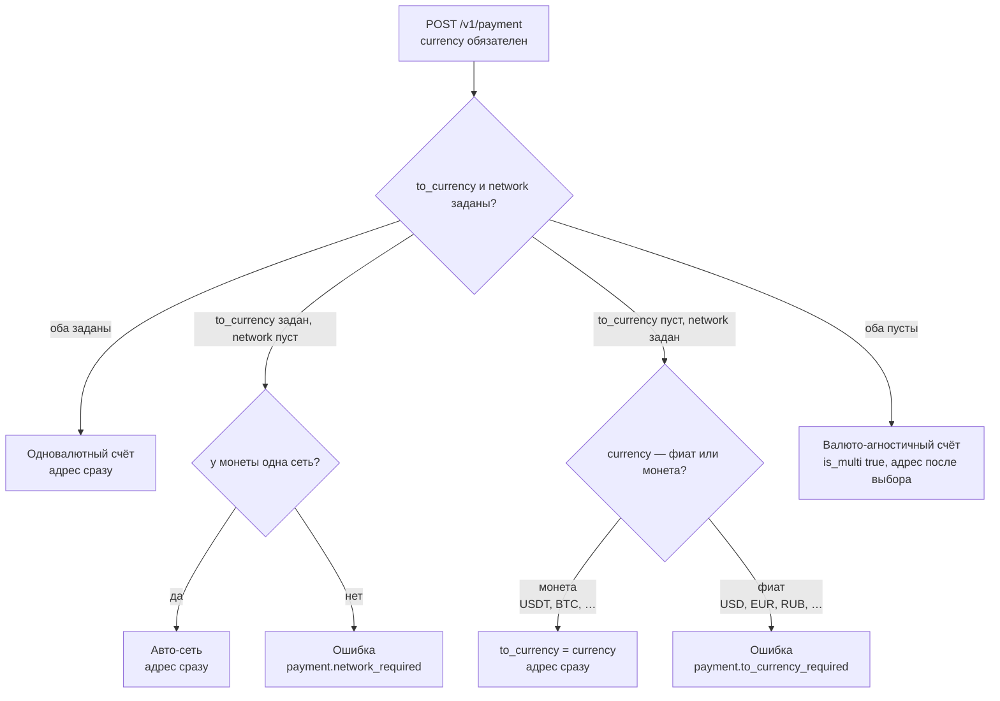
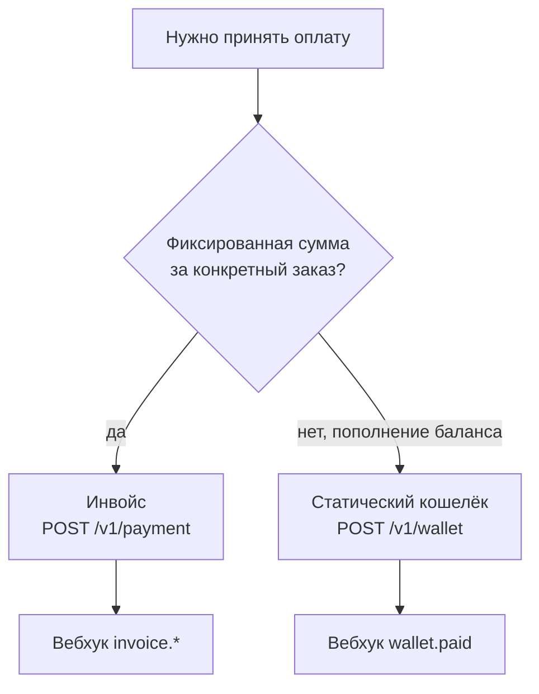

Визуальные схемы ключевых процессов Oblodai. Диаграммы написаны на Mermaid — они рендерятся в
большинстве просмотрщиков Markdown (включая GitHub). Если ваш просмотрщик не поддерживает Mermaid,
рядом с каждой есть текстовое описание.

---

## Поток приёма платежа (sequence)

Кто с кем взаимодействует при обычном платеже.

**Текстом:** ваш backend создаёт счёт → показывает покупателю адрес → покупатель платит в сеть →
Oblodai видит транзакцию и ждёт подтверждений → присылает вебхук `invoice.paid` → вы проверяете
подпись, дедуплицируете и выдаёте товар, отвечая `2xx`.

---

## Жизненный цикл платежа (статусы)

Как счёт переходит между [статусами `payment_status`](/reference/payment-object#статусы-payment_status).

**Текстом:** `check` (ждём оплату) → `confirm_check` (ждём подтверждений) → далее `paid`,
`paid_over` или `wrong_amount_waiting`. Недоплата в срок может дойти до `paid`, иначе — `wrong_amount`.
Неоплаченный счёт истекает в `cancel`. Терминальные (`is_final`): `paid`, `paid_over`, `wrong_amount`,
`cancel`.

---

## Жизненный цикл выплаты (статусы)

Внутренний цикл и его отображение в укрупнённый [`status`](/reference/payout-object#статусы-выплаты).

\* `awaiting_cosign` — для мерчантов с обязательным co‑sign: выплата ждёт второй подписи, прежде чем
перейти в `approved`. В укрупнённом `status` это отображается как `check`.

**Текстом:** внутренний путь `pending → approved → broadcasting → sent → confirmed` (для мерчантов с
обязательным co‑sign между `pending` и `approved` вклинивается `awaiting_cosign` — ожидание второй
подписи). В ответах API это сворачивается в `check` (pending/awaiting_cosign), `process`
(approved/broadcasting/sent), `paid` (confirmed), `fail` (failed), `cancel` (cancelled). По API‑ключу
выплата авто‑одобряется и сразу идёт в `process`.

<Note>
  Внутренние состояния (`pending`/`awaiting_cosign`/`approved`/`broadcasting`/`sent`/`confirmed`) показаны для справки;
  в API вам приходит укрупнённый `status` — см. [объект выплаты](/reference/payout-object).
</Note>

---

## Обработка вебхука (flow)

Что должен делать ваш обработчик на каждый входящий вебхук.

**Текстом:** пробное тело (`is_test`) — сразу `200`. Иначе проверить подпись по сырому телу (неверна —
`403`), затем дедуп по `uuid` + `status` (уже видели — `200`, no‑op), затем обработать. Успех — `200`
и запомнить ключ; неуспех — не‑2xx, чтобы Oblodai повторил доставку. →
[Настройка вебхуков](/guides/webhooks-setup)

---

## Три режима создания счёта (выбор)

Какой режим получится в зависимости от переданных полей. `currency` (валюта цены) обязателен всегда;
пустыми можно оставить `to_currency` и `network`.

**Текстом:** заданы валюта расчёта и сеть → обычный счёт. Задана только валюта расчёта → сеть
подставится, если она единственная, иначе `payment.network_required`. Задана только сеть: если цена в
**монете** — валютой расчёта станет она же; если цена в **фиате** (`USD`, `EUR`, `RUB`, …) — вывести из
неё монету расчёта невозможно, будет `payment.to_currency_required`. Ни `to_currency`, ни `network` не
заданы → покупатель выбирает монету и сеть на странице. →
[Три режима создания счёта](/guides/payment-modes)

---

## Инвойс vs статический кошелёк (выбор)

Что использовать под задачу.

**Текстом:** разовая покупка на фиксированную сумму — инвойс. Постоянный адрес пополнения (депозиты,
баланс клиента) — статический кошелёк. → [Статические кошельки](/guides/static-wallets)

---

## Связанные страницы

- [Объект платежа](/reference/payment-object) · [Объект выплаты](/reference/payout-object) · [Объект вебхука](/reference/webhook-object)
- [Приём первого платежа](/guides/accept-first-payment) · [Настройка вебхуков](/guides/webhooks-setup)
